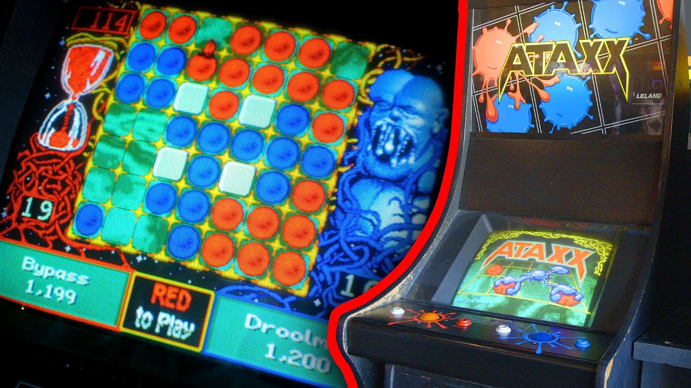

# Assegnazione Progetto

## Panoramica del Gioco

>Ataxx è un gioco di strategia a turni in cui due giocatori competono per conquistare il maggior numero di caselle possibili su una griglia 7x7. I giocatori alternano i loro turni, muovendo le proprie pedine su una griglia e trasformando le pedine avversarie in proprie pedine.

  

## Regole del Gioco

- **Obiettivo**: Il giocatore che alla fine del gioco possiede più pedine sulla griglia vince la partita.
- **Inizio del Gioco**: Ogni giocatore posiziona due pedine sui propri angoli della griglia.
- **Turno di Gioco**: I giocatori si alternano nel compiere una mossa per turno.
- **Mossa**: Durante il turno, un giocatore può muovere una pedina su una casella adiacente vuota o può clonare una propria pedina su una casella adiacente vuota.
- **Trasformazione delle Pedine**: Se una pedina viene mossa in una casella adiacente a una pedina avversaria, quest'ultima viene trasformata in una pedina del giocatore che ha mosso.
- **Fine del Gioco**: Il gioco termina quando tutte le caselle sono occupate o nessun giocatore può più muovere. Il giocatore con il maggior numero di pedine alla fine della partita è il vincitore.