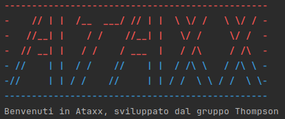

# Report

# 1 - Introduzione

## Partecipanti al progetto

Il team di sviluppatori è composta da:
+ **Michele Pontrelli ([MikiMik88](https://github.com/MikiMik88))**
+ **Francesco Sgaramella ([FraSga03](https://github.com/FraSga03))**
+ **Andrea Porcelli ([f1r3k3rn](https://github.com/f1r3k3rn))**
+ **Nicolo' Pacucci ([Pascoooo](https://github.com/Pascoooo))**
+ **Fabio Zippo ([IXRyu](https://github.com/IXRyu))**

## Descrizione progetto

Di seguito viene riportata la documentazione riguardante il progetto di "Ingegneria del Software" anno 2023/24 che implementa il gioco **Ataxx**.

Il progetto consiste nella realizzazione del videogioco di strategia per cabinati  **Ataxx** interfacciabile attraverso linea di comando.

<p align="center "></p>

L'implementazione offre solo la possibilità di effettuare una partita, assieme ad un altro giocatore, in multiplayer.

All'avvio, il gioco partirà impostato sulla variante _Default_ e su una griglia 7x7, tuttavia il giocatore avrà la possibilità di selezionare la variante che vuole giocare fra le seguenti:

- **Default**
- **Variante a Perdere**: Vince il giocatore che ha meno pedine del proprio colore
- **Thomas**: Movimento ortogonale
- **Assimilation/Infection**: Movimento ortognale e diagonale(non prevede movimenti a L)

Ogni variante diversa dalla _Default_  cambia le regole o impone limitazioni sullo spostamento delle pedine.

Il giocatore può modificare la dimensione della griglia partendo da una 4x4, con la possibilità di scegliere anche di rendere inaccessibili determinate caselle.

# 2 - Modello di Dominio
- Il seguente diagramma rappresenta il modello di dominio dell'applicazione Ataxx, realizzata utilizzando il web software [Lucidchart](https://www.lucidchart.com/)


## Chiarimenti scelte progettuali
- Relazioni **Mossa**  ⇄ **Pedina:**

Può sembrare intuitivo avere le relazioni che descrivono il comportamento della pedine direttamente con **Casella**, 
tuttavia abbiamo deciso di implementare una classe **Mossa** così da tener conto dello stato del gioco e rendendo più agevole 
la modifica delle regole del gioco determinate dalla variante scelta.
- Relazione **Giocatore**  ⇄ **Pedina:**

Abbiamo deciso di assegnare l'attributo "colorePedine" alla classe **Giocatore** e omettere un eventuale attributo colore sulla classe **Pedina** dal momento che una
pedina è sempre associata ad un giocatore da cui la pedina risale al colore evitando ridondanze.

# 3 - Requisiti Specifici
Di seguito vengono riportati i requisiti funzionali e non funzionali del progetto con stile di descrizione di tipo user story.
## 3.1 -Requisiti funzionali 
- **RF1: Come giocatore voglio mostrare l'help con elenco comandi**

    #### Criteri di accettazione

    Al comando `/help` o invocando l'app con flag `--help` o `-h` il risultato è una descrizione concisa, che normalmente appare all'avvio del programma, seguita dalla lista di comandi disponibili, uno per riga, come da esempio successivo:
    - gioca
    - esci
    - ...
    <br></br>
- **RF2: Come giocatore voglio iniziare una nuova partita**
 
    #### Criteri di accettazione
    
    Al comando `/gioca` se nessuna partita è in corso l'app mostra il tavoliere con le pedine in posizione iniziale e si predispone a ricevere la prima mossa di gioco dal giocatore con le pedine nere o altri comandi.
    <br></br>
- **RF3: Come giocatore voglio mostrare il tavoliere vuoto con la numerazione**

    #### Criteri di accettazione
    Al comando `/vuoto` l'app mostra il tavoliere vuoto di 49 caselle quadrate (7 per lato) con le righe numerate da 1 a 7 e le colonne numerate da ‘a’ a ‘g’.
    <br></br>
- **RF4: Come giocatore voglio mostrare il tavoliere con le pedine e la numerazione** 

    #### Criteri di accettazione
    Al comando `/tavoliere`:
    - se il gioco non è iniziato l'app suggerisce il comando `/gioca`;
    - se il gioco è iniziato l'app mostra la posizione di tutte   
      le pedine sul tavoliere. Le pedine sono mostrate in formato Unicode https://en.wikipedia.org/wiki/English_draughts#Unicode.
    <br></br>
- **RF5: Come giocatore voglio visualizzare le mosse possibili di una pedina** 

    #### Criteri di accettazione
    Al comando `/qualimosse`:
    - se il gioco non è iniziato l'app suggerisce il comando gioca;
    - se il gioco è iniziato l'app mostra quali mosse sono disponibili per il giocatore di turno, evidenziando:
        - in giallo le caselle raggiungibili con mosse che 
        generano una nuova pedina;
        - in arancione le caselle raggiungibili con mosse che consentono un salto;
        - in rosa le caselle raggiungibili con mosse di entrambi i tipi precedenti.
        <br></br>
- **RF6: Come giocatore voglio abbandonare la partita** 
    
    #### Criteri di accettazione
    Al comando `/abbandona` l'applicazione chiede conferma dell'azione:
    - se la conferma è positiva, l'app comunica che il Bianco (o Nero) ha vinto per abbandono e dichiara come vincitore l’avversario per x a 0 dove x è il numero di pedine rimaste dell’avversario;
    - se la conferma è negativa, l'app si predispone a ricevere nuovi tentativi o comandi.
    <br></br>
- **RF7: Come giocatore voglio chiudere il gioco** 

    #### Criteri di accettazione
    Al comando `/esci` l'applicazione chiede conferma:
    - se la conferma è positiva, l'app si chiude restituendo il controllo al sistema operativo;
    - se la conferma è negativa, l'app si predispone a ricevere nuovi tentativi o comandi.
## 3.2 - Requisiti non funzionali
- **RNF1**: Il container docker dell'app deve essere eseguito da terminali che supportano Unicode con encoding UTF-8 o UTF-16. A seguito un elenco di terminali adeguati divisi per sistema operativo:
    - **Linux:** terminal;
    - **Windows:** Powershell, Git Bash; 
    - **MacOS:** terminal (a seguito della modifica delle impostazioni di encoding).
# 7 - Manuale Utente 

## Procedura Preliminare
Prima di poter avviare il gioco bisogna essere sicuri di trovarsi in un ambiente che permette la
sua esecuzione, per questo lasciamo una guida completa di tutti i passaggi preparatori:

## Guida
- Come prima cosa bisogna installare l'applicazione [Docker Desktop](https://www.docker.com/products/docker-desktop/) e verificarne la corretta installazione
- Autenticarsi con github tramite CLI come segue:

<h2> Creazione Token per il Docker login</h2>

Verificare di utilizzare uno dei terminali supportati riportati in 

- [Requisiti non funzionali](#32-requisiti-non-funzionali)

Per ottenere un token per l'accesso alle risorse di GitHub, segui i passaggi descritti di seguito:

1. **Registrazione**: Se non hai già un account, [registrati su GitHub](https://github.com/join) per ottenere un account.

2. **Accesso**: Accedi al tuo account GitHub utilizzando le tue [credenziali di accesso](https://github.com/login).


3. **Generazione del token**: Una volta effettuato l'accesso, vai alle impostazioni del tuo account. Puoi accedervi cliccando sulla tua immagine del profilo e selezionando `Settings`.
Nella sezione `Developer settings`, seleziona `Personal access tokens` dal menu a sinistra.


4. **Generazione**: Fai clic sul pulsante `Generate new token`


5. **Autorizzazioni**: Seleziona le autorizzazioni necessarie per il token.


6. **Copia il token**: Una volta generato, copia il token. GitHub mostrerà il token solo una volta, quindi assicurati di copiarlo e conservarlo in un luogo sicuro.

A questo punto si è pronti per accedere a Docker tramite Github PAT

<h2>  Autenticazione Docker ed Avvio </h2>

1. **Copia del token su un file `.txt`**:

    Copia il token generato in precedenza in un file di testo, ad esempio, `token.txt`


2. **Ottenere il percorso del file**:

    Dopo aver creato il file, copia il percorso completo


3. **Login a GitHub Container Registry (GHCR) tramite Docker**:

    Apri il terminale come amministratore ed esegui il seguente comando, sostituendo `PATH_DEL_TOKEN` con il percorso copiato e `USERNAME` con il tuo nome utente GitHub:

```bash
cat "PATH_DEL_TOKEN/token.txt" | docker login ghcr.io -u "USERNAME" --password-stdin
```
4. **Scaricare l'immagine tramite Docker Pull**:

   Una volta effettuato l'accesso con successo, puoi scaricare l'immagine Docker desiderata con il seguente comando:

```shell
docker pull ghcr.io/softeng2223-inf-uniba/battleship-thompson:latest
```
5. **Esecuzione del container Docker**:
   Una volta eseguito l'accesso e scaricata l'immagine con successo, puoi eseguire l'immagine Docker desiderata con 
   il seguente comando: 
```shell
docker run --rm -it ghcr.io/softeng2324-inf-uniba/ataxx-thompson:latest
```
Questo comando avvierà il gioco Ataxx

## Regole di Gioco
#### **Regole Base(Default)**
- Il gioco è composto da un tavoliere di 49 caselle quadrat e da 49 pedine bicolori
- Le pedine si posizionano nelle caselle
- Si gioca in due persone
- Inizia il nero ed i giocatori giocano a turno
- Una mossa può essere di due tipi:
  - Il giocatore gioca una nuova pedina sul tavoliere in una casella adiacente a un'altra in cui vi sia già una propria pedina
  - Il giocatore sposta una propria pedina di due caselle, solo se la casella di arrivo è libera e non adiacente alla casella d'origine
- Se al termine della mossa vi sono pedine avversarie adiacenti alla casella di arrivo, queste vengono catturate e devono essere girate
- Non è possibile rinunciare a girare le pedine catturate
- Vince il giocatore che ha più pedine del proprio colore al termine della partita
- Il punteggio di una vittoria è dato dalla differenza delle pedine
- Per trascrivere una partita si utilizzano le lettere per le colonne e i numeri per le righe, indicando le caselle di partenza e di arrivo delle pedine.
Esistono inoltre varianti che modificano elementi del gioco base, offrendo diverse strategie e novità ai giocatori:
#### **Variante A Perdere**:
  - In questa variante, vince il giocatore che al termine della partita ha meno pedine del proprio colore, mantenendo le regole base del gioco.
#### **Variante Thomas (o Nutsy Ataxx)**:
  - In questa variante ideata da Louis K. Thomas, il posizionamento di una nuova pedina, il salto e la cattura avvengono solo in senso ortogonale. Le altre regole rimangono le stesse.

- **Variante Assimilation (o Infection)**:
  - In questa variante, gli spostamenti possono essere effettuati solo in maniera ortogonale o diagonale, escludendo i salti a "L".
  - Le regole base del gioco restano invariate.

## Guida All'Utilizzo

- ### **All'avvio:**
    <details open>Visualizzazione banner di benvenuto <p align="center"></p>
    <summary>Visualizza Dettagli</summary>
    </details>
  
- ### **All'avvio con Parametri `-h` o `--help`:**
    <details open> Visualizzazione banner con i comandi disponibili in attesa di input.
        <summary>Visualizza Dettagli</summary>
    </details>

- ### **Al Comando `/gioca`:**
    <details open>Mostra il tavoliere con le pedine in posizione iniziale
        <summary>Visualizza Dettagli</summary>
    </details>
  
- ### **Al comando `/vuoto`:**
    <details open>Mostra il tavoliere vuoto enumerato.
        <summary>Visualizza Dettagli</summary>
    </details>
- ### **Al comando `/tavoliere`:**
    <details open>Mostra il tavoliere con pedine e numerazione, se non si è iniziata una partita suggerisce il comando <code>/gioca</code>.
        <summary>Visualizza Dettagli</summary>
    </details>

- ### **Al comando `/qualimosse`:**
    <details open>Mostra le mosse possibili colorando le caselle diversamente in base al tipo di mossa disponibile in essa.
        <summary>Visualizza Dettagli</summary>
    </details>
  
- ### **Al comando `/abbandona`:**
    <details open>Chiede conferma per l'abbandono della partita, se confermato dichiara il vincitore per x a 0 dove x è il numero di pedine rimaste dell'avversario.
        <summary>Visualizza Dettagli</summary>
    </details>

- ### **Al comando `/esci`:**
    <details open>Chiude il gioco e restituisce il controllo al sistema operativo.
        <summary>Visualizza Dettagli</summary>
    </details>

# 9 - Analisi Retrospettiva

## 9.1 - Sprint 0

### Analisi retrospettiva effettuata il 20/04/2024

L'analisi retrospettiva è iniziata con la creazione di una lavagna Mad-Glad-Sad per raccogliere le sensazioni e le emozioni del team
dopo  aver chiuso lo Sprint 0. 

Di seguito riportiamo la tabella creata:


Dalla tabella si evince che:
<ul>
    <li>Il team è contento di:
        <ul>
            <li>Essere riuscito ad organizzarsi al meglio</li>
            <li>Aver diviso equamente il lavoro assegnato</li>
            <li>Aver consegnato in orario il lavoro</li>
            <li>Esser riusciti s coordinarci anche attraverso meeting a distanza</li>
        </ul>
    </li>
    <li>Il team è triste per:
        <ul>
            <li>Non aver creato uno standard per la scrittura degli issue come ad esempio il titolo</li>
            <li>Non aver sempre rispettato lo stile delle commit imposto dal CODE OF CONDUCT</li>
        </ul>
    </li>
    <li>Il team è arrabbiato per:
        <ul>
            <li>Non aver creato review idonee per alcune pull request</li>
        </ul>
    </li>
</ul>

### Miglioramenti proposti

Dopo aver analizzato le problematiche il team ha sancito i seguenti suggerimenti:
- Riguardo alla fretta nelle revisioni, i membri convengono nel porre più attenzione nel controllare il lavoro svolto
- Riguardo al mancato rispetto dello stile dei commit, ognuno si assume la responsabilità di eventuali errori commessi e si impegna a controllare il codice di condotta se incerto
- Riguardo alla scrittura degli issue il team decide di stabilire uno stile per la scrittura degli stessi

### Conclusioni
In generale conveniamo nell'avere una responsabilità individuale oltre a quella di team, ognuno si impegnerà a svolgere correttamente il proprio lavoro evitando errori dovuti a distrazione o fretta.
