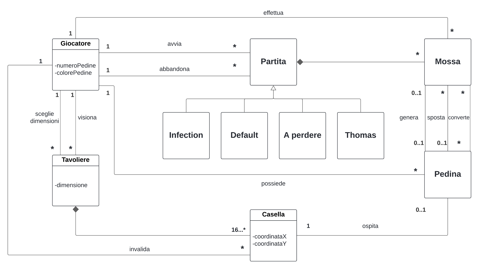

# Report

# 1 - Introduzione

## Partecipanti al progetto

Il team di sviluppatori è composta da:
+ Michele Pontrelli ([MikiMik88](https://github.com/MikiMik88))
+ Francesco Sgaramella ([FraSga03](https://github.com/FraSga03))
+ Andrea Porcelli ([f1r3k3rn](https://github.com/f1r3k3rn))
+ Nicolo' Pacucci ([Pascoooo](https://github.com/Pascoooo))
+ Fabio Zippo ([IXRyu](https://github.com/IXRyu))

## Descrizione progetto

Di seguito viene riportata la documentazione riguardante il progetto di "Ingegneria del Software" anno 2023/24 che implementa il gioco **Ataxx**.

Il progetto consiste nella realizzazione del videogioco di strategia per cabinati  **Ataxx** interfacciabile attraverso linea di comando.

    

L'implementazione offre solo la possibilità di effettuare una partita, assieme ad un altro giocatore, in multiplayer.

All'avvio, il gioco partirà impostato sulla variante _Default_ e su una griglia 7x7, tuttavia il giocatore avrà la possibilità di selezionare la variante che vuole giocare fra le seguenti:

- **Default**
- **Variante a Perdere**: Vince il giocatore che ha meno pedine del proprio colore
- **Thomas**: Movimento ortogonale
- **Assimilation/Infection**: Movimento ortognale e diagonale(non prevede movimenti a L)

Ogni variante diversa dalla _Default_  cambia le regole o impone limitazioni sullo spostamento delle pedine.

Il giocatore può modificare la dimensione della griglia partendo da una 4x4, con la possibilità di scegliere anche di rendere inaccessibili determinate caselle.

# 2 - Modello di Dominio
- Il seguente diagramma rappresenta il modello di dominio dell'applicazione Ataxx, realizzata utilizzando il web software [Lucidchart](https://www.lucidchart.com/)

## Chiarimenti scelte progettuali
- Relazioni **Mossa**  ⇄ **Pedina**
Può sembrare intuitivo avere le relazioni che descrivono il comportamento della pedine direttamente con **Casella**, 
tuttavia abbiamo deciso di implementare una classe **Mossa** così da tener conto dello stato del gioco e rendendo più agevole 
la modifica delle regole del gioco determinate dalla variante scelta.
- Relazione **Giocatore**  ⇄ **Pedina**
Abbiamo deciso di assegnare l'attributo "colorePedine" alla classe **Giocatore** e omettere un eventuale attributo colore sulla classe **Pedina** dal momento che una
pedina è sempre associata ad un giocatore da cui la pedina risale al colore evitando ridondanze.

# 9 - Analisi retrospettiva

## 9.1 - Sprint 0

### Analisi retrospettiva effettuata il 20/04/2024

L'analisi retrospettiva è iniziata con la creazione di una lavagna Mad-Glad-Sad per raccogliere le sensazioni e le emozioni del team
dopo  aver chiuso lo Sprint 0. 

Di seguito riportiamo la tabella creata:

Dalla tabella si evince che:
<ul>
    <li>Il team è contento di:
        <ul>
            <li>Essere riuscito ad organizzarsi al meglio</li>
            <li>Aver diviso equamente il lavoro assegnato</li>
            <li>Aver consegnato in orario il lavoro</li>
            <li>Esser riusciti s coordinarci anche attraverso meeting a distanza</li>
        </ul>
    </li>
    <li>Il team è triste per:
        <ul>
            <li>Non aver creato uno standard per la scrittura degli issue come ad esempio il titolo</li>
            <li>Non aver sempre rispettato lo stile delle commit imposto dal CODE OF CONDUCT</li>
        </ul>
    </li>
    <li>Il team è arrabbiato per:
        <ul>
            <li>Non aver creato review idonee per alcune pull request</li>
        </ul>
    </li>
</ul>

#### Miglioramenti proposti

Dopo aver analizzato le problematiche il team ha sancito i seguenti suggerimenti:
- Riguardo alla fretta nelle revisioni, i membri convengono nel porre più attenzione nel controllare il lavoro svolto
- Riguardo al mancato rispetto dello stile dei commit, ognuno si assume la responsabilità di eventuali errori commessi e si impegna a controllare il codice di condotta se incerto
- Riguardo alla scrittura degli issue il team decide di stabilire uno stile per la scrittura degli stessi

#### Conclusioni
In generale conveniamo nell'avere una responsabilità individuale oltre a quella di team, ognuno si impegnerà a svolgere correttamente il proprio lavoro evitando errori dovuti a distrazione o fretta.