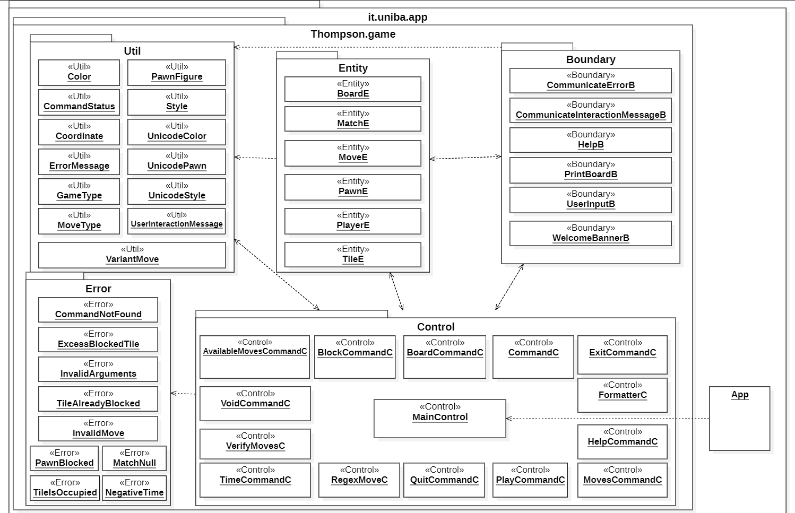
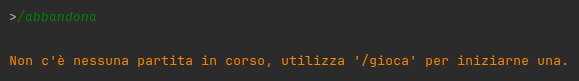

# Report
# Indice
- ### [**1 - Introduzione**](#1---introduzione)
  -  [**1.1 - Sviluppatori**](#partecipanti-al-progetto)
  -  [**1.2 - Descrizione Progetto**](#descrizione-progetto)
- ### [**2 - Modello di Dominio**](#2---modello-di-dominio)
- ### [**3 - Requisiti Specifici**](#3---requisiti-specifici)
    - [**3.1 - Requisiti Sprint 1**](#31---requisiti-sprint-1)
      -  [**3.1.1 - Funzionali**](#311---funzionali)
      - [**3.1.2 - Non Funzionali**](#312---non-funzionali)
    - [**3.2 - Requisiti Sprint 2**](#32---requisiti-funzionali-sprint-2)
- ### [**7 - Manuale Utente**](#7---manuale-utente)
  - [**7.1 - Procedura Preliminare**](#procedura-preliminare)

    <ul>
    <li><h4><a href="#github"> 7.1.1 - Creazione Token Github </a></h4></li>
    
    <li><h4><a href="#docker"> 7.1.2 - Autenticazione Docker </a></h4></li>
    </ul>
  
  - [**7.2 - Regole di Gioco**](#regole-di-gioco)
    - [**7.2.1 - Varianti**](#varianti)
  - [**7.3 - Guida All'Utilizzo**](#guida-allutilizzo)
- ### [**8 - Processo di sviluppo e organizzazione del lavoro**](#8-processo-di-sviluppo-e-organizzazione-del-lavoro)
    - [**8.1 - Introduzione al processo di sviluppo**](#81---introduzione-al-processo-di-sviluppo)
    - [**8.2 - Roadmap degli sprint**](#82---roadmap-degli-sprint)
    - [**8.3 - Gestione degli Sprint**](#83---gestione-degli-sprint)
    - [**8.4 - Software utilizzati**](#84---software-utilizzati)
    - [**8.5 - Comunicazione interna al team**](#85---comunicazione-interna-al-team)
- ### [**9 - Analisi Retrospettiva**](#9---analisi-retrospettiva)
    - [**9.1 - Sprint 0**](#91---sprint-0)
    - [**9.2 - Sprint 1**](#92---sprint-1)

# 1 - Introduzione

## Partecipanti al progetto

Il team di sviluppatori è composta da:
+ **Michele Pontrelli ([MikiMik88](https://github.com/MikiMik88))**
+ **Francesco Sgaramella ([FraSga03](https://github.com/FraSga03))**
+ **Andrea Porcelli ([f1r3k3rn](https://github.com/f1r3k3rn))**
+ **Nicolo' Pacucci ([Pascoooo](https://github.com/Pascoooo))**
+ **Fabio Zippo ([IXRyu](https://github.com/IXRyu))**
## Descrizione progetto

Di seguito viene riportata la documentazione riguardante il progetto di "Ingegneria del Software" anno 2023/24 che implementa il gioco **Ataxx**.

Il progetto consiste nella realizzazione del videogioco di strategia per cabinati  **Ataxx** interfacciabile attraverso linea di comando.

<p align="center "></p>

L'implementazione offre solo la possibilità di effettuare una partita, assieme ad un altro giocatore, in multiplayer.

All'avvio, il gioco partirà impostato sulla variante _Default_ e su una griglia 7x7, tuttavia il giocatore avrà la possibilità di selezionare la variante che vuole giocare fra le seguenti:

- **Default**
- **Variante a Perdere**: Vince il giocatore che ha meno pedine del proprio colore
- **Thomas**: Movimento ortogonale
- **Assimilation/Infection**: Movimento ortognale e diagonale(non prevede movimenti a L)

Ogni variante diversa dalla _Default_  cambia le regole o impone limitazioni sullo spostamento delle pedine.

Il giocatore può modificare la dimensione della griglia partendo da una 4x4, con la possibilità di scegliere anche di rendere inaccessibili determinate caselle.

#### [Ritorna all'Indice](#indice)

# 2 - Modello di Dominio
- Il seguente diagramma rappresenta il modello di dominio dell'applicazione Ataxx, realizzata utilizzando il web software [Lucidchart](https://www.lucidchart.com/)


#### [Ritorna all'Indice](#indice)

# 3 - Requisiti Specifici
Di seguito vengono riportati i requisiti funzionali e non funzionali del progetto con stile di descrizione di tipo user story.
## 3.1 - Requisiti Sprint 1:
**Obiettivo: piccoli comandi**
### 3.1.1 - Funzionali

- **RF1: Come giocatore voglio mostrare l'help con elenco comandi**

    #### Criteri di accettazione

    Al comando `/help` o invocando l'app con flag `--help` o `-h` il risultato è una descrizione concisa, che normalmente appare all'avvio del programma, seguita dalla lista di comandi disponibili, uno per riga, come da esempio successivo:
    - gioca
    - esci
    - ...
    <br></br>
- **RF2: Come giocatore voglio iniziare una nuova partita**
 
    #### Criteri di accettazione
    
    Al comando `/gioca` se nessuna partita è in corso l'app mostra il tavoliere con le pedine in posizione iniziale e si predispone a ricevere la prima mossa di gioco dal giocatore con le pedine nere o altri comandi.
    <br></br>
- **RF3: Come giocatore voglio mostrare il tavoliere vuoto con la numerazione**

    #### Criteri di accettazione
    Al comando `/vuoto` l'app mostra il tavoliere vuoto di 49 caselle quadrate (_7 per lato_) con le righe numerate da 1 a 7 e le colonne numerate da ‘A’ a ‘G’.
    <br></br>
- **RF4: Come giocatore voglio mostrare il tavoliere con le pedine e la numerazione** 

    #### Criteri di accettazione
    Al comando `/tavoliere`:
    - se il gioco non è iniziato l'app suggerisce il comando `/gioca`;
    - se il gioco è iniziato l'app mostra la posizione di tutte   
      le pedine sul tavoliere. Le pedine sono mostrate in formato Unicode https://en.wikipedia.org/wiki/English_draughts#Unicode.
    <br></br>
- **RF5: Come giocatore voglio visualizzare le mosse possibili di una pedina** 

    #### Criteri di accettazione
    Al comando `/qualimosse`:
    - se il gioco non è iniziato l'app suggerisce il comando gioca;
    - se il gioco è iniziato l'app mostra quali mosse sono disponibili per il giocatore di turno, evidenziando:
        - in giallo le caselle raggiungibili con mosse che 
        generano una nuova pedina;
        - in arancione le caselle raggiungibili con mosse che consentono un salto;
        - in rosa le caselle raggiungibili con mosse di entrambi i tipi precedenti.
        <br></br>
- **RF6: Come giocatore voglio abbandonare la partita** 
    
    #### Criteri di accettazione
    Al comando `/abbandona` l'applicazione chiede conferma dell'azione:
    - se la conferma è positiva, l'app comunica che il Bianco (_o Nero_) ha vinto per abbandono e dichiara come vincitore l’avversario per x a 0 dove x è il numero di pedine rimaste dell’avversario;
    - se la conferma è negativa, l'app si predispone a ricevere nuovi tentativi o comandi.
    <br></br>
- **RF7: Come giocatore voglio chiudere il gioco** 

    #### Criteri di accettazione
    Al comando `/esci` l'applicazione chiede conferma:
    - se la conferma è positiva, l'app si chiude restituendo il controllo al sistema operativo;
    - se la conferma è negativa, l'app si predispone a ricevere nuovi tentativi o comandi.

### 3.1.2 - Non Funzionali
- **RNF1**: Il container docker dell'app deve essere eseguito da terminali che supportano Unicode con encoding UTF-8 o UTF-16. A seguito un elenco di terminali adeguati divisi per sistema operativo:
    - **Linux:** terminal;
    - **Windows:** Powershell, Git Bash; 
    - **MacOS:** terminal (_a seguito della modifica delle impostazioni di encoding_).

## 3.2 - Requisiti Funzionali Sprint 2
**Obiettivo: completare il gioco assicurando la qualità del software**
- **RF1: Come giocatore voglio giocare una nuova pedina in una casella adiacente a una propria pedina**

  #### Criteri di accettazione
  A partita in corso di gioco, l'applicazione deve accettare che il giocatore di turno giochi sul tavoliere una nuova pedina (_bianca o nera_) in una casella adiacente (_in senso ortogonale e diagonale_) ad un'altra in cui vi sia già una propria pedina, utilizzando una notazione algebrica del tipo: `a1-a2`, dove `a1` è la casella di partenza e `a2` è la casella adiacente.
  <br></br>
- **RF2: Come giocatore voglio spostare una propria pedina saltando una casella adiacente**

  #### Criteri di accettazione
  A partita in corso di gioco, l'applicazione deve accettare che il giocatore di turno sposti sul tavoliere una propria pedina (_bianca o nera_) con il salto di una casella adiacente, utilizzando una notazione algebrica del tipo: `a1-a3`, dove `a1` è la casella di partenza e `a3` è la casella di arrivo.
  La casella di arrivo deve essere libera e non deve essere adiacente alla casella originaria.
  La casella saltata può anche essere occupata da una propria pedina o da una pedina avversaria.
  <br></br>
- **RF3: Come giocatore voglio catturare una pedina avversaria come effetto di una mossa**

  #### Criteri di accettazione
  Se al termine di una mossa vi sono pedine avversarie adiacenti alla casella di arrivo, sia per la mossa di espansione che di spostamento, queste vengono catturate cambiando di colore.
  <br></br>
- **RF4: Come giocatore voglio mostrare le mosse giocate**

  #### Criteri di accettazione
  Al comando `/mosse`, l'app mostra la storia delle mosse con notazione algebrica.
  Per esempio:
  - 1 a1-a2 (N); 
  - 2 g7-g6 (B);
  <br></br>
- **RF5: Come giocatore voglio passare il turno per impossibilità di movimento**

  #### Criteri di accettazione
  Se il giocatore non può muovere nessuna pedina del proprio colore, l’app avvisa che il turno passa all’altro colore.
  <br></br>
- **RF6: Come giocatore voglio visualizzare il fine partita con il vincitore e i punti segnati**

  #### Criteri di accettazione
  Se nessuna pedina può essere mossa perché le caselle del tavoliere sono state tutte riempite, allora l’app dichiara il vincitore (_bianco o nero_) e riporta i punti del bianco e bero contando le rispettive pedine.
  <br></br>
  L'app si predispone a ricevere nuovi comandi.
  <br></br>
- **RF7: Come giocatore voglio mostrare il tempo di gioco**

  #### Criteri di accettazione

  Al comando `/tempo`, l'app mostra il tempo trascorso dall’inizio partita nel formato `ore:minuti:secondi`.
  <br></br>
  L'app si predispone a ricevere nuovi comandi
<br></br>
- **RF8: Come giocatore voglio impostare caselle non accessibili**

  #### Criteri di accettazione
  A partita non in corso, al comando `/blocca xn`, dove `xn` sono le coordinate di una casella,
  la casella `xn` non è accessibile per le pedine ed è mostrata sul tavoliere con uno sfondo grigio.
  <br></br>
  **Non è possibile bloccare:**
  
  - Le caselle di partenza del gioco;
  - Tutte le caselle adiacenti a una casella di partenza del gioco, rendendo impossibile la mossa di espansione di una pedina a inizio gioco
  - Tutte le caselle a distanza 2 da una casella di partenza del gioco, rendendo impossibile la mossa di salto di una pedina a inizio gioco
<br></br>
    Inoltre non è possibile bloccare più di 9 caselle.
#### [Ritorna all'Indice](#indice)

# 4 - System Design

## Diagramma dei Pacchetti
Il seguente diagramma rappresenta la struttura dei pacchetti utilizzati per implementare il progetto, realizzato utilizzando il software [StarUML](https://staruml.io/)


#### [Ritorna all'Indice](#indice)


# 7 - Manuale Utente 

## Procedura Preliminare
Prima di poter avviare il gioco bisogna essere sicuri di trovarsi in un ambiente che permette la
sua esecuzione, per questo lasciamo una guida completa di tutti i passaggi preparatori:

- Come prima cosa bisogna installare l'applicazione [Docker Desktop](https://www.docker.com/products/docker-desktop/) e verificarne la corretta installazione
- Autenticarsi su Docker con github access token tramite CLI come segue:

<h2 id="github">  Creazione Token per il Docker login</h2>

Verificare di utilizzare uno dei terminali supportati riportati in 

- [Requisiti non funzionali](#312---non-funzionali)

Per ottenere un token per l'accesso alle risorse di GitHub, segui i passaggi descritti di seguito:

1. **Registrazione**: Se non hai già un account, [registrati su GitHub](https://github.com/join) per ottenere un account.

2. **Accesso**: Accedi al tuo account GitHub utilizzando le tue [credenziali di accesso](https://github.com/login).


3. **Generazione del token**: Una volta effettuato l'accesso, vai alle impostazioni del tuo account. Puoi accedervi cliccando sulla tua immagine del profilo e selezionando `Settings`.
Nella sezione `Developer settings`, seleziona `Personal access tokens` dal menu a sinistra.


4. **Generazione**: Fai clic sul pulsante `Generate new token`


5. **Autorizzazioni**: Seleziona le autorizzazioni necessarie per il token.


6. **Copia il token**: Una volta generato, copia il token. GitHub mostrerà il token solo una volta, quindi assicurati di copiarlo e conservarlo in un luogo sicuro.

A questo punto si è pronti per accedere a Docker tramite Github PAT

<h2 id="docker">  Autenticazione Docker ed Avvio </h2>

1. **Copia del token su un file `.txt`**:

    Copia il token generato in precedenza in un file di testo, ad esempio, `token.txt`


2. **Ottenere il percorso del file**:

    Dopo aver creato il file, copia il percorso completo


3. **Login a GitHub Container Registry (GHCR) tramite Docker**:

    Apri il terminale come amministratore ed esegui il seguente comando, sostituendo `PATH_DEL_TOKEN` con il percorso copiato e `USERNAME` con il tuo nome utente GitHub:

```bash
cat "PATH_DEL_TOKEN/token.txt" | docker login ghcr.io -u "USERNAME" --password-stdin
```
4. **Scaricare l'immagine tramite Docker Pull**:

   Una volta effettuato l'accesso con successo, puoi scaricare l'immagine Docker desiderata con il seguente comando:

```shell
docker pull ghcr.io/softeng2223-inf-uniba/battleship-thompson:latest
```
5. **Esecuzione del container Docker**:
   Una volta eseguito l'accesso e scaricata l'immagine con successo, puoi eseguire l'immagine Docker desiderata con 
   il seguente comando: 
```shell
docker run --rm -it ghcr.io/softeng2324-inf-uniba/ataxx-thompson:latest
```
Questo comando avvierà il gioco Ataxx

#### [Ritorna all'Indice](#indice)

## Regole di Gioco
#### **Regole Base(Default)**
- Il gioco è composto da un tavoliere di 49 caselle quadrat e da 49 pedine bicolori
- Le pedine si posizionano nelle caselle
- Si gioca in due persone
- Inizia il nero ed i giocatori giocano a turno
- Una mossa può essere di due tipi:
  - Il giocatore gioca una nuova pedina sul tavoliere in una casella adiacente a un'altra in cui vi sia già una propria pedina
  - Il giocatore sposta una propria pedina di due caselle, solo se la casella di arrivo è libera e non adiacente alla casella d'origine
- Se al termine della mossa vi sono pedine avversarie adiacenti alla casella di arrivo, queste vengono catturate e devono essere girate
- Non è possibile rinunciare a girare le pedine catturate
- Vince il giocatore che ha più pedine del proprio colore al termine della partita
- Il punteggio di una vittoria è dato dalla differenza delle pedine
- Per trascrivere una partita si utilizzano le lettere per le colonne e i numeri per le righe, indicando le caselle di partenza e di arrivo delle pedine.
## **Varianti**
- Esistono inoltre varianti che modificano elementi del gioco base, offrendo diverse strategie e novità ai giocatori:
#### **Variante A Perdere**:
  - In questa variante, vince il giocatore che al termine della partita ha meno pedine del proprio colore, mantenendo le regole base del gioco.
#### **Variante Thomas (o Nutsy Ataxx)**:
  - In questa variante ideata da Louis K. Thomas, il posizionamento di una nuova pedina, il salto e la cattura avvengono solo in senso ortogonale. Le altre regole rimangono le stesse.

- **Variante Assimilation (o Infection)**:
  - In questa variante, gli spostamenti possono essere effettuati solo in maniera ortogonale o diagonale, escludendo i salti a "L".
  - Le regole base del gioco restano invariate.
  - 
#### [Ritorna all'Indice](#indice)

## Guida All'Utilizzo

- ### All'avvio:
    <details open>Visualizzazione banner di benvenuto 
        <p align="center"></p>
      <summary>Visualizza Dettagli</summary>
    </details>

- ### All'avvio con Parametri `-h` o `--help`:
    <details open> Visualizzazione banner con i comandi disponibili.
        <p align="center"></p>
        <h5>Nell'immagine è riportato anche il caso in cui viene passato un parametro non valido.</h5>
      <summary>Visualizza Dettagli</summary>
    </details>

- ### Al Comando `/help`:
    <details open>Mostra la lista di comandi disponibili.
        <p align="center"></p>
      <summary>Visualizza Dettagli</summary>
    </details>

- ### Al Comando `/gioca`:
    <details open>Mostra il tavoliere con le pedine in posizione iniziale
        <p align="center"></p>
      <summary>Visualizza Dettagli</summary>
    </details>

- ### Al comando `/vuoto`:
    <details open>Mostra il tavoliere vuoto enumerato. 
        <p align="center"></p>
      <summary>Visualizza Dettagli</summary>
    </details>

- ### Al comando `/tavoliere`:
    <details open>
        <h4>Scenario 1:</h4> Corretta chiama del comando, mostra il tavoliere con pedine ed enumerazione
        <p align="center"></p>
    <h4>Scenario 2:</h4>
        Nel caso si provi a mostrare il tavoliere senza una partita avviata, suggerirà il comando <code>/gioca</code>.
        <p align="center"></p>
    <summary>Visualizza Dettagli</summary>
    </details>

- ### Al comando `/qualimosse`:
    <details open> Mostra le mosse possibili colorando le caselle diversamente in base al tipo di mossa disponibile in essa.
      <h4>Scenario 1:</h4>Il giocatore può effettuare mosse di tipo 1 e 2:
          <p align="center"></p>
      <h4>Scenario 2:</h4>
          Nel caso in cui non ci sia nessuna partita in atto, suggerirà il comando <code>/gioca</code>.
          <p align="center"></p>
      <summary>Visualizza Dettagli</summary>
    </details>
  
- ### Al comando `/abbandona`:
    <details open> Chiede conferma per l'abbandono della partita, se confermato dichiara il vincitore per x a 0 dove x è il numero di pedine rimaste dell'avversario.
      <h4>Scenario 1:</h4>
        Esempio di corretta esecuzione del comando:
        <p align="center"></p>
      <h4>Scenario 2:</h4>
        Esempio di esecuzione del comando con conferma negativa:
        <p align="center"></p>
      <h4>Scenario 3:</h4>
        Esempio di esecuzione con partita non in corso:
        <p align="center"></p>
      <h4>Scenario 4:</h4> 
        Esempio di errore nell'input del giocatore che abbandona:
        <p align="center"></p>
      <h4>Scenario 5:</h4>
        Esempio di scelta non valida:
        <p align="center"></p>
      <summary>Visualizza Dettagli</summary>
    </details>

- ### Al comando `/esci`:
    <details open>Chiude il gioco e restituisce il controllo al sistema operativo.<p align="center"></p>
      <h5>In output un messaggio di arrivederci.</h5>
      <summary>Visualizza Dettagli</summary>
    </details>

#### [Ritorna all'Indice](#indice)

# 8 - Processo di sviluppo e organizzazione del lavoro
## 8.1 - Introduzione al processo di sviluppo
Durante l'intero periodo di sviluppo del progetto, il gruppo ha adoperato il metodo dello sviluppo software [
*Agile*](https://agilemanifesto.org/iso/it/manifesto.html). Lo sviluppo Agile consiste in una fase iniziale di *analisi
dei requisiti* con progressivi *miglioramenti* e *aggiornamenti* del prodotto software svolti dai membri del team di
sviluppo.

Seguendo i principi cardine dello sviluppo Agile, il team è stato in grado di pianificare e organizzare i task assegnati
in maniera efficiente, con l'obbiettivo di ottenere un prodotto software stabile e robusto.

Il processo di sviluppo è stato strutturato seguendo un approccio [*simil-Scrum*](https://www.scrum.org/). La
metodologia Scrum offre delle iterazioni time-boxed, dette anche **Sprint**. In questo modo si è potuto suddividere
l'intero sviluppo del progetto in 3 Sprint, ciascuno dei quali avente durata di 2 settimane.

Il professore ha interpretato il ruolo di **Product Owner**. Per ogni Sprint, in aula e via [_Microsoft
Teams_](https://www.microsoft.com/en-us/microsoft-teams/group-chat-software), ci sono stati comunicati i requisiti,
sotto forma di *Definition of Done* e *User Story*. Il team ha provveduto a realizzare una Board per ogni Sprint e dallo
Sprint 1 è stato anche realizzato il Product Backlog, per contenere le User Story degli Sprint successivi.

È stata definita un'organizzazione in stile Kanban per una Board avente 5 sezioni:

- **To Do**: Task da risolvere;
- **In Progress**: Task prese in carico dall'assignee;
- **Review**: Task risolte, in fase di revisione;
- **Ready**: Task risolte e revisionate dai reviewers;
- **Done**: Task risolte, revisionate dai reviewers e approvate dal *Product Owner*.

La Board è stata gestita utilizzando la sezione Project messa a disposizione da Github. Tale organizzazione, per la
gestione dei task, è stata imposta per lo Sprint 0 per mostrare al team un modo per dividere il lavoro e tracciare i
progressi dei vari task.
È stato concesso al team la libertà di autogestirsi, avendo valutato come
ottimale questa struttura, è stato deciso di mantenere lo stesso approccio utilizzato nello Sprint 0.

Per la gestione dello sviluppo dei task è stato utilizzato il [_Github
Flow_](https://docs.github.com/en/get-started/quickstart/github-flow): per ogni issue, identificata progressivamente
con `#n`, è stato creato un branch, identificato come concordato ad inizio progetto `/[feat | fix | ref][nome_issue]/`, da parte del componente a cui è stata assegnata la
issue. Una volta che il componente, ha concluso
il suo lavoro, veniva sottoposto a un minimo di 2 reviewers, attraverso una **Pull Request**, in cui si discutevano
eventuali problemi e/o migliorie per portare a termine la issue, una volta approvata la Pull Request, il suo
branch viene unito al branch principale e, una volta unito, il branch della Pull Request viene cancellato.

A ogni Sprint, svolto all'interno del progetto, è stato dedicato una **Milestone** e un **Project** dove, all'interno
di ogni Project, sono state inserite le issue da svolgere per lo Sprint corrente.
In questo modo, è stato possibile avere un quadro generale dei task dei progressi fatto dal team, tenendo così traccia
di quali erano le issue da iniziare, quali in corso, quali in revisione e quali pronte alla revisione del *Product Owner*.

Ogni qualvolta una issue veniva conclusa, i progressi di completamento della Milestone venivano aggiornati e, il suo
completamento, significava il completamento delle issue assegnate per lo Sprint corrente.


## 8.2 - Roadmap degli sprint

| Sprint No. | Descrizione                                                | Data Inizio | Data Fine  | Durata    | Data Feedback |
|------------|------------------------------------------------------------|-------------|------------|-----------|---------------|
| 0          | Dimostrare familiarità con GitHub e il processo agile      | 31/03/2024  | 12/04/2024 | 13 giorni | 15-19/04/2024 |
| 1          | Piccoli comandi                                            | 06/05/2024  | 21/06/2024 | 15 giorni | 30-31/05/2024 |
| 2          | Completare il gioco, assicurando la qualità del software   | 29/05/2024  | 14/06/2024 | 16 giorni | 13-27/06/2024 | 

## 8.3 - Gestione degli Sprint

Dato l'utilizzo del framework Scrum, gli Sprint si compongono di quattro fasi principali: analisi, progettazione,
implementazione e testing

Il team fin da subito ha deciso di non puntare tutto sulle capacità individuali, ma di lavorare in sinergia, condividendo 
le conoscenze e le competenze, per ottenere un prodotto di qualità, per questo motivo, è stato deciso di assegnare 
gli issue tutti assieme e di ciclare i ruoli di reviewer e assignee per ogni issue, per evitare creazioni di sottogruppi ed aumentare la sinergia complessiva.

Il team è cosciente che ogni persona ha dei punti forti e dei punti deboli, ma proprio per questo abbiamo deciso nel primo meeting di adottare questo approccio,
per poter migliorare le nostre competenze e conoscenze, e per poter lavorare in un ambiente collaborativo e di crescita continua.

1. ### **Fase di analisi:**

   - Il team si è sempre riunito in un meeting iniziale per discutere e analizzare i requisiti del progetto, in modo da poterli suddividere in issue e assegnarli ai membri del team.

2. ### **Fase di progettazione:**

   - Il team utilizzando il framework Scrum per la gestione degli Sprint, ha potuto dividere il lavoro in maniera equa e trasparente.

3. ### **Fase di implementazione:**

   - Il team lavora in maniera sinergica per risolvere gli issues, condividendo le conoscenze e le competenze, per ottenere un prodotto di qualità.

4. ### **Fase di testing:**

   - Il team svolge un testing per verificare che ad ogni issue risolta, non ci fossero errori e che il codice fosse conforme alle regole di sviluppo imposte dal team.

#### [Ritorna all'Indice](#indice)

## Sprint 0

Lo *Sprint Goal* era quello di mostrare familiarità con [_Git_](https://git-scm.com/), [_Github_](https://github.com/) e
il processo Agile.
- Per questo Sprint si sono decise tutte le regole di sviluppo e di condotta da seguire per il progetto, in modo da
  garantire un ambiente di lavoro sano e collaborativo. Abbiamo scelto una durata di circa 30m-1h per il daily scrum, 
  in modo da poter discutere i problemi e le soluzioni trovate.


- Nella **fase di analisi** si sono risolti i primi issue, in modo da poter prendere confidenza con il processo di
  sviluppo e con gli strumenti utilizzati.


- In questo Sprint, i task riguardavano per lo più documentazione in modo da permettere ai componenti del team di
    prendere confidenza con gli strumenti e i processi senza aggiungere complicazione dovute all'analisi, alla
    progettazione e alla stesura di codice. Data quindi la natura delle attività, la **fase di progettazione** non è stata
    inclusa.


- Nella **fase di implementazione** si sono risolti gli issue assegnati, in modo da poter prendere confidenza con il
  processo di sviluppo e con gli strumenti utilizzati.


- Nella **fase di testing** si sono verificati che gli issue risolti non presentassero errori e che il codice fosse
  conforme alle regole di sviluppo imposte dal team.

## Sprint 1

Lo *Sprint Goal* era quello di preparare il gioco.
- Questo sprint è stato dedicato alla realizzazione dei primi comandi del gioco, in modo da poter iniziare a sviluppare
  il gioco vero e proprio.


- Nella **fase di analisi** abbiamo deciso di assegnare a ciascuna coppia del team un issue, cercando di calibrare 
chi avesse più esperienza a scrive codice e chi avesse più esperienza a scrivere documentazione, in modo da poter equilibrare le coppie. Ci sono stati però issue che sono state assegnate a singoli membri, poichè 
troppo semplici e quindi non abbiamo avuto bisogno di dividere il lavoro, quest'ultimi sono stati casi sporadici.
Il team fin da subito ha voluto puntare sulla massima modularità del codice creando un diagramma di classi con prospettiva concettuale ricco di dettagli.
Le classi sono state divise in package in modo da poter avere una visione più chiara del codice e per poterlo dividere in maniera più efficiente, risutando in un implementazione più pulita e ordinata.


- Nella **fase di progettazione** si sono discusse le soluzioni da adottare per risolvere gli issue assegnati, ogni gruppo da due presentava la propria soluzione e i restanti membri ponevano domande e critiche,
in modo da poter migliorare la soluzione proposta.


- Nella **fase di implementazione** si sono risolti gli issue assegnati come descritto nella fase di progettazione, 
  seguendo le regole di sviluppo imposte dal team.


- Nella **fase di testing** si sono verificati che gli issue risolti non presentassero errori e che il codice fosse
  conforme alle regole di sviluppo imposte dal team.

## Sprint 2

Lo *Sprint Goal* era quello di completare il gioco, assicurando la qualità del software.

- Nella **fase di analisi** abbiamo deciso di assegnare a ciascuna coppia del team un issue come nello sprint precedente,
  In particolare. si è scelto di dedicare del tempo alla **manutenzione evolutiva** del codice scritto, 
  così da ridurre il più possibile _codice ridondante_ però grazie alla visione avuta durante lo sprint precedente queste modifiche sono state ridotte al minimo.


- Nella **fase di progettazione** sono stati sviluppati il **diagramma dei package**, relativo al System Design, insieme
  ai **diagrammi delle classi** e i **diagrammi di sequenza** delle user story principali


- Nella **fase di implementazione** si sono risolti gli issue assegnati come descritto nella fase di progettazione, 
  seguendo le regole di sviluppo imposte dal team come negli sprint precedenti, Una volta terminate le user story del codice, il team si è dedicato alla successiva fase di
  manutenzione evolutiva, richiedendo attivamente feedback agli altri membri del gruppo di lavoro, sfruttando i canali
  comunicativi interni al gruppo.


- Nella **fase di testing** si sono verificati che gli issue risolti non presentassero errori e che il codice fosse
  conforme alle regole di sviluppo imposte dal team, inoltre si è svolto un testing con [Junit](https://junit.org/junit5/) per verificare che il gioco fosse conforme ai requisiti richiesti.

## 8.4 - Software utilizzati

- **Organizzazione e Review del lavoro**
  - [*Microsoft Teams*](https://www.microsoft.com/en-us/microsoft-teams/group-chat-software), in cui venivano definiti
    i compiti per ogni Sprint;
  - [*Discord*](https://discord.com/), per le riunioni interne al team;
  - [*Whatsapp*](https://www.whatsapp.com/), per organizzare le riunioni sincrone.
- **Ambienti di sviluppo**
  - [*IntelliJ IDEA*](https://www.jetbrains.com/idea/) il team ha concordato di usare un IDE omogeneo per tutti i membri, è stato scelto IntelliJ per la sua versatilità e per la sua facilità d'uso.
    - *Plugin aggiuntivi*
      - [*CheckStyle IDEA*](https://plugins.jetbrains.com/plugin/1065-checkstyle-idea), per controllare eventuali
        problemi di CheckStyle evitando così di eseguire sempre il comando `./gradlew build`;
      - [*Gradle*](https://gradle.org/), utilizzato per l'esecuzione del programma all'interno d'IntelliJ;
      - [*Code With Me*](https://www.jetbrains.com/code-with-me/) è un tool d'IntelliJ che permette di lavorare
        in maniera collaborativa su un progetto, permettendo di
        condividere il proprio IDE con altri utenti, in modo da poter lavorare in maniera sincrona sullo stesso
        progetto.
- **Software per la creazione di diagrammi**
  - [*StarUML*](https://staruml.io/), dato il precedente utilizzo di alcuni membri del team.
## 8.5 - Comunicazione interna al team

*Esempio di comunicazione asincrona tramite gruppo Whatsapp.*


*In questa foto è possibile vedere come Discord sia stato utile per lo svolgimento del lavoro, grazie all'uso di canali vocali, testuali e la possibilità di condividere il proprio schermo.*


*In questa foto è possibile vedere l'uso della chat testuale di Discord, in cui condividere immagini e file, in particolare i due link sono per sfruttare il Code with me di IntelliJ !*


#### [Ritorna all'Indice](#indice)

# 9 - Analisi Retrospettiva
- In questa sezione andremo ad analizzare i nostri comportamenti durante lo sviluppo del software
ed il rispetto delle regole di sviluppo imposte dal team, dal codice di condotta e dal manifesto dello sviluppo agile.
Si riporteranno i punti forza e debolezza emersi durante lo sviluppo del progetto tramite tabelle ed infine 
verranno suggeriti i miglioramenti proposti per evitare errori simili in futuro.


## 9.1 - Sprint 0

### Analisi retrospettiva effettuata il 20/04/2024

L'analisi retrospettiva è iniziata con la creazione di una lavagna Mad-Glad-Sad per raccogliere le sensazioni e le emozioni del team
dopo  aver chiuso lo Sprint 0. 

Di seguito riportiamo la tabella creata:


Dalla tabella si evince che:
<ul>
    <li>Il team è contento di:
        <ul>
            <li>Essere riuscito ad organizzarsi al meglio</li>
            <li>Aver diviso equamente il lavoro assegnato</li>
            <li>Aver consegnato in orario il lavoro</li>
            <li>Esser riusciti s coordinarci anche attraverso meeting a distanza</li>
        </ul>
    </li>
    <li>Il team è triste per:
        <ul>
            <li>Non aver creato uno standard per la scrittura degli issue come ad esempio il titolo</li>
            <li>Non aver sempre rispettato lo stile delle commit imposto dal CODE OF CONDUCT</li>
        </ul>
    </li>
    <li>Il team è arrabbiato per:
        <ul>
            <li>Non aver creato review idonee per alcune pull request</li>
        </ul>
    </li>
</ul>

## Miglioramenti proposti

Dopo aver analizzato le problematiche il team ha sancito i seguenti suggerimenti:
- Riguardo alla fretta nelle revisioni, i membri convengono nel porre più attenzione nel controllare il lavoro svolto
- Riguardo al mancato rispetto dello stile dei commit, ognuno si assume la responsabilità di eventuali errori commessi e si impegna a controllare il codice di condotta se incerto
- Riguardo alla scrittura degli issue il team decide di stabilire uno stile per la scrittura degli stessi

## Conclusioni
In generale conveniamo nell'avere una responsabilità individuale oltre a quella di team, ognuno si impegnerà a svolgere correttamente il proprio lavoro evitando errori dovuti a distrazione o fretta.

#### [Ritorna all'Indice](#indice)

## 9.2 - Sprint 1

### Analisi retrospettiva effettuata il 30/05/2024

L'analisi retrospettiva è partita discutendo insieme del lavoro svolto nello sprint 1 riflettendo su punti di forza e 
debolezza davanti ad una tabella Mad-Sad-Glad

Di seguito riportiamo la tabella creata:


Dalla tabella si evince che:
<ul>
    <li>Il team è contento di:
        <ul>
            <li>Aver mantenuto un alto grado di organizzazione come nel precedente sprint</li>
            <li>Aver minimizzato i conflitti nei merge avendo usato un IDE che permette di programmare in contemporanea sullo stesso file</li>
            <li>Aver risolto le discussioni sulla progettazione concettuale in maniera adulta e arrivando alla miglior soluzione possibile</li>
            <li>Non aver mai fatto pesare gli errori ai membri, aiutandosi quando ce n'è stato bisogno</li>
            <li>Essere rimasti saldi davanti ad un carico di lavoro elevato senza esser presi dal panico</li>
            <li>Essere stati pronti ad apprendere nuove cose di fronte ad argomenti mai affrontati prima</li>
        </ul>
    </li>
    <li>Il team è triste per:
        <ul>
            <li>Aver effettuato pause che hanno ritardato di molto il lavoro e rovinato il flusso</li>
            <li>Non aver avuto un livello di parallelizzazione sufficientemente alto</li>
            <li>Esser stati indecisi di fronte alla realizzazione della user interface in CLI</li>
            <li>Non aver stabilito un orario fisso per i daily scrum, nonostante siano stati eseguiti efficacemente</li>
</ul>
    </li>
    <li>Il team è arrabbiato per:
        <ul>
            <li>La mancata definizione per tempo di uno standard per la stesura della Javadoc, il che ha portato a frequenti modifiche ad essa</li>
            <li>Eccessive revisioni dovute ad incertezze ed ambiguità che sarebbero state risolte se definite una unica volta</li>
            <li>Non aver testato l'eseguibile remoto abbastanza frequentemente, affidandoci troppo all'esecuzione in locale</li>
        </ul>
    </li>
</ul>

## Miglioramenti proposti

Dopo aver analizzato i punti riportati nella tabella, il team ha deciso di:
- Stabilire uno standard per ogni evenienza della Javadoc(effettuato a fine sprint1), che ci si impegna ora a riportare nel code of conduct
- Deciso di programmare i meeting con più anticipo in modo da tener conto di tutte le necessità
- Testare l'eseguibile remoto più spesso, soprattutto dopo modifiche importanti o aggiunta di funzionalità
- Stabilire il contenuto di una revisione ed effettuarlo in maniera efficiente oltre che efficace
- Non interrompere il flusso di lavoro in modo forzato e problematico
- Parallelizzare di più il lavoro, pur continuando a revisionare il lavoro a vicenda

## Conclusioni
Il team conviene nel dire che il lavoro è stato svolto in maniera corretta ma che ci sia sempre un margine di miglioramento, 
infatti, per esempio, sicuramente programmando prima dell'esecuzione e parallelizzando di più il lavoro si può svolgere il tutto in maniera molto più efficiente.

#### [Ritorna all'Indice](#indice)